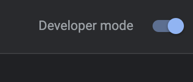
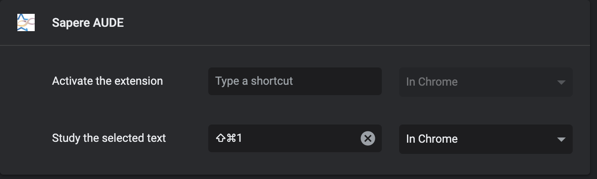
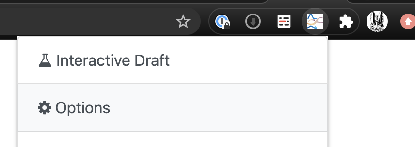

# SAPERE AUDE
> Latin for "Dare to know things", A textual based bioinformatic chrome extension

## It's a Chrome Extension!

### Installation steps
* If you are using chrome, go to [this configuration page](chrome://extensions/)
* On the upper right corner, turn on "Developer mode"

* Click "Load unpacked" button

* Select this directory of codes as the root folder

### Hotkey Config
* go to [this shortcut setup page](chrome://extensions/shortcuts)
* configure the "Study the selected text" hotkey, here I choose "command shift 1" for making example.

### Server config
* Go to options page by click the extension options, fill in every field properly

### Enjoy!
#### Method A
* Go to the interactive draft page, fill in the text yourself

#### Method B
* Browse any web page, eg pubmed, tcga etc, and select the text you want to analyze
* Press the hotkey you've configured (In my example "command shift 1")